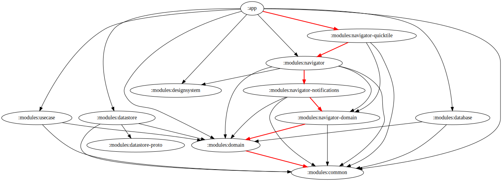

  

<h1 align="center">File Navigator</h1>

  <b>The missing link between Android and a sorted file system.</b>

  
  
  
  
   
  
  
   
  
  
  

File Navigator watches Android's shared storage for new files and helps move them
to the folders where they belong. Rules can distinguish not only between file
types, but also between sources such as the camera, screenshots, downloads,
recordings, and other apps.

The app supports Android 11 and newer.

## Features

- **File discovery notifications** - get notified when a new matching file
  appears and move, open, or delete it directly from the notification.
- **Quick Move** - assign frequently used destination folders to a file source
  and move files with a single action.
- **Auto Move** - automatically route new files to configured folders without
  further interaction.
- **Source-specific rules** - configure different behavior for camera photos,
  screenshots, recordings, downloads, and files created by other apps.
- **Built-in file types** - organize pictures, videos, audio, PDFs, text files,
  archives, APKs, and eBooks.
- **Custom file types** - create your own categories with a name, color, and set
  of file extensions.
- **Configurable extensions** - include or exclude extensions from supported
  non-media file types.
- **Batch moving** - collect multiple active navigation notifications and move
  their files to one destination.
- **Move history** - review previously moved files and their destinations.
- **Quick Settings tile** - start or stop the navigator from Android's Quick
  Settings panel.
- **Background controls** - optionally start on boot and stop navigation when
  the battery is low.
- **Material 3 appearance** - follow the system theme, use light or dark mode,
  enable dynamic colors, and opt into an AMOLED black theme.

## How It Works

1. Select the file types and sources that File Navigator should observe.
2. Start the navigator.
3. When a matching file appears, either choose a new destination or a configured Quick Move
   destination from the notification, or let an Auto Move rule handle it.
4. Review completed operations in the move history.

Android restricts access to app-private storage. File Navigator therefore works
with files exposed through shared storage and Android's media and document APIs.

## Download

  
  
  
  

## Screenshots

<table>
  <tr>
    <td></td>
    <td></td>
    <td></td>
    <td></td>
  </tr>
</table>

## Tech Stack

- [Kotlin](https://kotlinlang.org/) and
  [Kotlin Coroutines](https://github.com/Kotlin/kotlinx.coroutines)
- [Jetpack Compose](https://developer.android.com/compose) with Material 3
- [Navigation 3](https://developer.android.com/guide/navigation/navigation-3)
- [Hilt](https://developer.android.com/training/dependency-injection/hilt-android)
  for dependency injection
- [Room](https://developer.android.com/training/data-storage/room) for move
  history
- Protocol Buffers and DataStore-backed preferences for persistent
  configuration
- Android MediaStore, Storage Access Framework, foreground services,
  notifications, and Quick Settings APIs
- Gradle convention plugins and a version catalog for shared build
  configuration
- JUnit, Robolectric, MockK, Turbine, and Compose UI tests
- Baseline Profiles for startup and runtime performance

## Architecture

| Module | Responsibility |
| --- | --- |
| `:app` | Compose UI, app navigation, and top-level dependency wiring |
| `:modules:domain` | Core models, repository contracts, and use-case contracts |
| `:modules:usecase` | Domain use-case implementations |
| `:modules:navigator` | File observation, moving, and foreground service behavior |
| `:modules:navigator-domain` | Navigator-specific models and contracts |
| `:modules:navigator-notifications` | Navigation and move notifications |
| `:modules:navigator-quicktile` | Quick Settings tile integration |
| `:modules:database` | Room database and move-history persistence |
| `:modules:datastore` | Persisted navigator and app configuration |
| `:modules:datastore-proto` | Generated Protocol Buffer configuration models |
| `:modules:designsystem` | Shared Compose theme and UI components |
| `:modules:common` | Shared Android utilities and resources |
| `:modules:test` | Shared test dependencies and utilities |
| `:benchmarking` | Baseline Profile generation and macrobenchmarks |

## Permissions

File Navigator requests only the platform capabilities required for its core
workflow:

- **Manage all files** to observe and move files in shared storage.
- **Notifications** to present newly discovered files and move actions.
- **Foreground service** access to keep the navigator active in the background.
- **Selected-folder access** through Android's system picker for Quick Move and
  Auto Move destinations.

Folder access granted through the system picker is persisted so the same
destination does not need to be approved for every move.

## Contributing

Bug reports and feature requests are welcome in
[GitHub Issues](https://github.com/w2sv/FileNavigator/issues). For code
changes, keep commits focused and ensure `./gradlew check assembleDebug` passes
before opening a pull request.

## Donations

  

## License

File Navigator is distributed under the
[GNU General Public License v3.0](LICENSE).

Copyright © [w2sv](https://github.com/w2sv), 2023-present.
